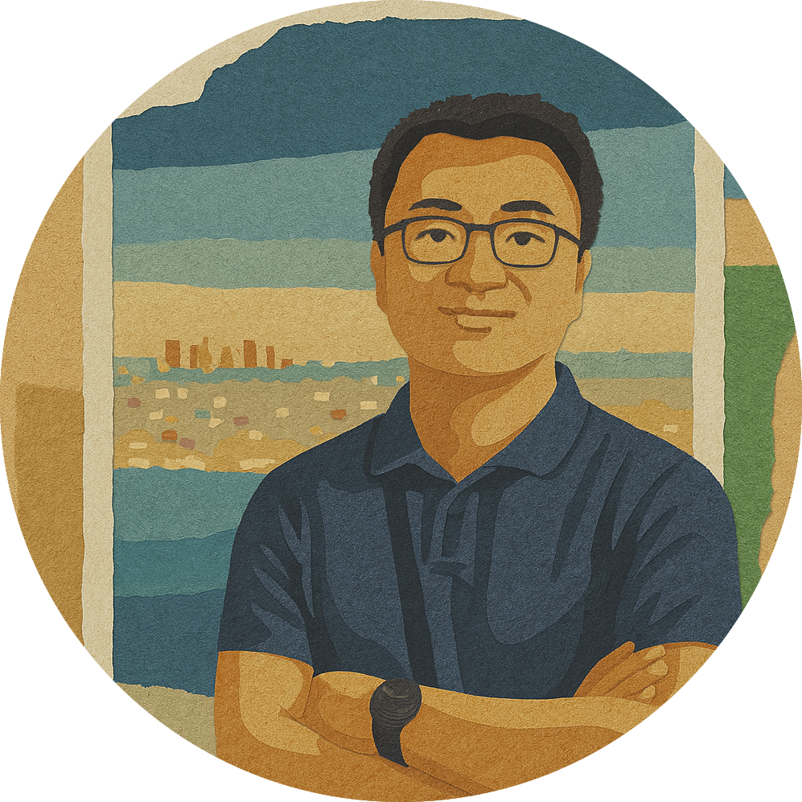

<!--  -->

Hello! I'm **Zhuofan Li (李卓凡)**. I'm interested in questions about human activities that are entangled with capitalism, technology, power, and time.

My first "big project" looks at the decentralization of power and knowledge through "corporate open science" --- an interesting phenomenon that puzzles even insiders to the industry: why would tech companies defy their interests in intellectual property to participate in open science, a movement to make knowledge and knowledge infrastructure --- publications, code, data, methodology, and benchmarks --- accessible to all? 

This work has been funded by an American Sociological Association Doctoral Dissertation Research Improvement Grant.

I have also written about facial recognition companies, image data annotators, cancer clinics, and tokenized executives. My methodological work helps sociologists translate network, language, and visual data into theoretical insights.

I received my Ph.D. in Sociology from the University of Arizona in 2024 and am currently an Assistant Professor of Sociology at Virginia Tech.

I was born in Tangshan, a coal-mining, industrial city in Northern China that witnessed one of the earliest labor movements in the country and was rebuilt from ruin after one of the deadliest earthquakes in recorded history. I spent my youth in Beijing's golden years of globalization, and have been on the move ever since. On pleasantly unproductive days, I enjoy reading, skiing, watching European football, hoarding games on Steam, and "stargazing" on GitHub.

How to say my name: Zhuofan /jwo-fahn/, or check out this [website](https://www.chinesenamesinenglish.com/wiki/Zhuofan) for how to pronounce Chinese names. 
