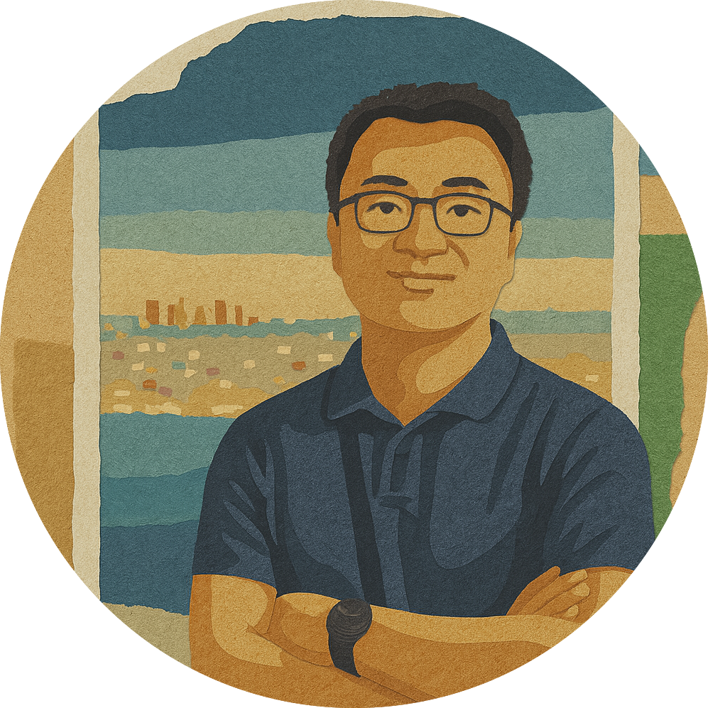

<!--  -->

Hello! I'm **Zhuofan Li (李卓凡)**. I study digital society and its relationship with capitalism, technology, power, and time.

My current book project examines the transformation of corporate power behind the global AI industry through an interesting paradox called "corporate open science": Why would tech companies defy their interests in intellectual property to participate in open science, a movement to make knowledge and knowledge infrastructure --- publications, code, data, methodology, and benchmarks --- accessible to all? This work has received an American Sociological Association Doctoral Dissertation Research Improvement Grant.

I have also written about facial recognition companies, image data annotators, terminal cancer patients, tokenized executives, and how machine learning can help sociologists translate network, text, visual, and spatial data into theoretical insights. Some of these works can be found in *American Sociological Review*, *Social Networks*, *Annual Review of Sociology*, *RSF: The Russell Sage Foundation Journal of the Social Sciences*, and *Socius*.

I received my Ph.D. in Sociology from the University of Arizona in 2024. I am currently an Assistant Professor of Sociology at Virginia Tech, where I teach in Digital Sociology.

I was born in Tangshan, a coal-mining, industrial city in Northern China that witnessed one of the earliest labor movements in the country and was rebuilt from ruin after one of the deadliest earthquakes in recorded history. I spent my youth in Beijing during its golden years of globalization, and have been on the move ever since. On pleasantly unproductive days, I enjoy reading, skiing, watching European football, hoarding games on Steam, and "stargazing" on GitHub.

How to say my name: Zhuofan /jwo-fahn/, or check out this [website](https://www.chinesenamesinenglish.com/wiki/Zhuofan) for how to pronounce Chinese names.
